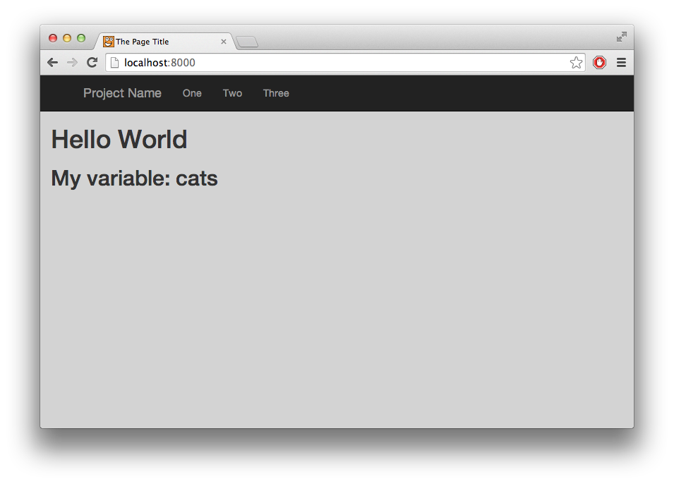
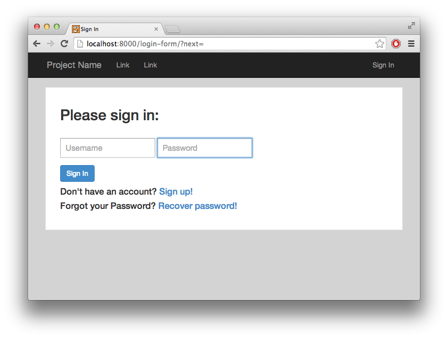
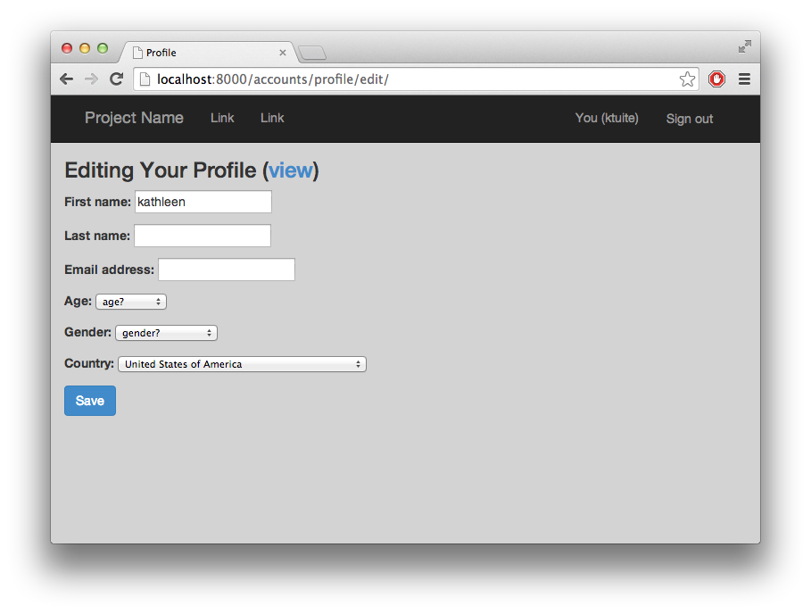
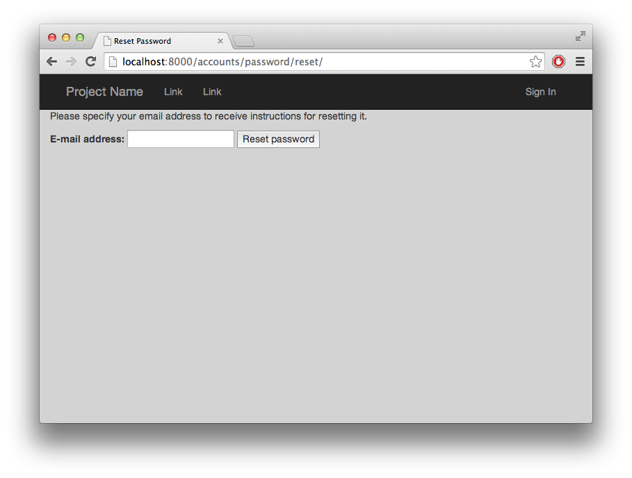

# Starter Django Project

Components:
* Login system (with pages for registering, signing in, and password recovery)
* Bootstrap CSS and JQuery Javascript
* Example urls, models, views
* Saving user data to media folder

Things to customize:
* Database: local sqlite file or real mysql server
* Email address for sending password recovery (I just use a Gmail account)

## How I created this project (using Django 1.6)

### Step 1: Run commands to create boilerplate Django code

    django-admin.py startproject django_base
    cd django_base
    python manage.py startapp custom_app
    python manage.py runserver

* There are a lot of nested folders with the same names, now. The outer `django_base` (the one that contains manage.py) can be named whatever you want now. I happened to start this project _inside_ of a folder I already was calling something django-related. Pathnames from here on out are relative to the other `django_base` folder with manage.py in it. 

### Step 2: Edit django_base/settings.py 
* Add `django_base` to the list of `INCLUDED_APPS`
* Add `custom_app` to list of `INCLUDED_APPS` 
* Change database settings here (actually I left them as the default sqlite database for now)

### Step 3: Create directories to hold HTML, CSS, and Javascript
* Create `django_base/static/` and `django_base/templates/` directories for CSS, Javascript, and HTML
    * Put bootstrap and jquery files in `static`
    * Create a `django_base/templates/base.html` that other templates will extend from
* Create `custom_app/templates/custom_app/`
    * HTML templates go here
    * This directory is super redundant in its naming so that you can use templates from other apps

### Step 4: Create a view! 
* Make a `custom_app/urls.py`
* Add `custom_app` urls to `django_base/urls.py` (I made the root of my site point to the urls in `custom_app`)
* Add the actual url path/route for the first view/webpage
* Make a function for it in `custom_app/views.py`
* Make an html file in `custom_app/templates/custom_app/<myview>.html` that extends `base.html`

## How I added Login Stuff

### Step 1: Set up the database (let django automatically create user tables) and create a super user account

    python manage.py syncdb

### Step 2: Set up the right URLs and built-in django views
* Some of the views are things that django already handles and some are things I have to make myself.
* Most templates django doesn't really have alreadly (except for the admin password reset form) so I had to remake those.
* I had a version of all this code cobbled together, so I copied it and cleaned it up and made sure it all worked.
* make sure order of INSTALLED_APPS has our apps at the top so the django admin password reset doesnt clobber them

### Step 3: Add a custom/extended UserProfile object that stores extra information about a user
* Look in `django_base/models.py` ... there are some extra functions that tell django to automatically make this extra user information object when a new user is created.
* After adding this and trying to edit my own profile, I got this error: _User has no userprofile._ 
    * It's a special extra field attached to my user, which was made before this extra info existed, so I just deleted the database, reran `syncdb`, and remade my user.

### Step 4: Add sign in and current user to header

### Notable files

*django_base/settings.py*
* Where INSTALLED_APPS go, including the root app and any other apps (self-contained sub-projects or sub-urls) you make
* Where pretty much any and every setting goes, including database setup, password recovery email addresses, authentication keys for 3rd party things